# Intro to IM Assignments
## Here you can find documentation for ALL of my assignemnts 

### June 2

I wanted to make a backround of moving circles and a bouncing circle on top, but after experimenting with that I found it too difficult to look and and decided to make them static. 

I used a nested for loop to make the background and experimented with the example from the class to make the circle on top.
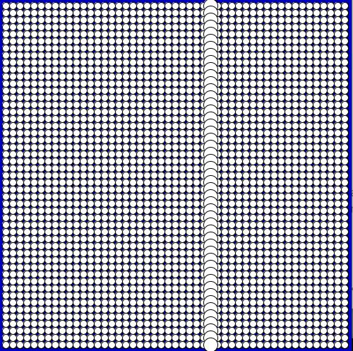

### June 3

I got the idea for my artwork from one of Daniel's video about functions where he used a star. I wanted to make an artwork where there is a setting sun and as it sets, multiple stars pop on on the screen. 
##### Challenges 
I faced a lot of challenges. I havent actually used processing before, and I find coding in general quite challenging. I watched Daniel's videos on functions and OOP and then watched them again trying to understand exactly what he is doing and how it works and what each line is doing. I then went back to the examples we did in class and tried to do it on my own without looking to see if I understood it. I then tried to write my own twist on it and use the code to write something that I want it to do, but that took me a very long time. I then tried to debug it and understand what I did wrong. 

### June 7
##### Data Visualisation
I wanted to display the data in an abstact bar chart, abstract because the bars don't represent direct values but rather scaled down to look best aesthetically. I was aiming for something minimalistic so I opted for black bars on a white background. 
It was challenging to me because I was still trying to wrap my head around how processing works, but I'm quite happy with how it looks.

The data is taken from https://www.ndbc.noaa.gov
##### Transformation
I used my artwork from June2 to repurpose for use with transformation. I spent a lot of time experimenting with different transformations and trying to undertsnad how they were affecting the drawing until I arrived to three patterns that I found to be the most interesting visually and decided to have them as a sort of series of artworks. The most challenging part with this assignemt for me was understanding how the transformation was actually affecting the visual image. 
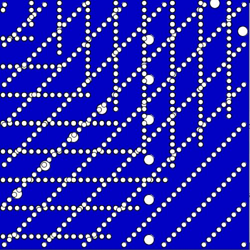
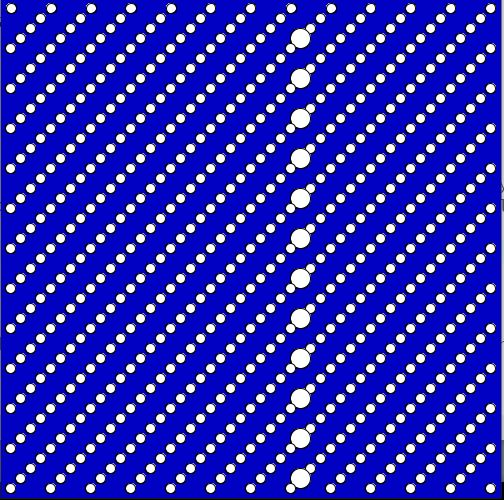
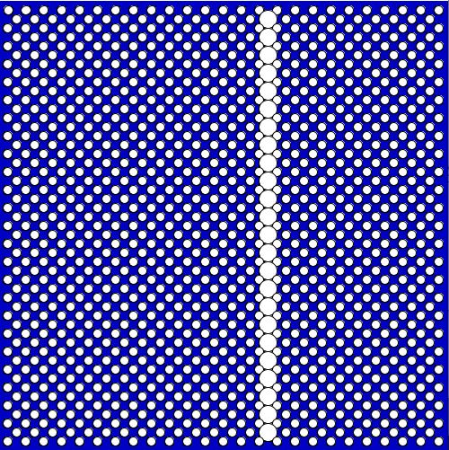

### June 8

I wanted to have an image that you can edit by drawing on it. I used the picture of a drawing and set it up such that you can draw on it by clicking down the mouse. 

##### Challenges
I wanted to be able to pick the colour from the spot where you clicked the mouse to draw with that colour, but the line always ended up grey and I still wasn't able to understand why it was doing that. So I decided to go back on that and simply use one colour to draw. 

### June 10 - Midterm

I was inspired by one of Daniel's videos in which he did a coding challenge and made a game of pong. 
I wanted to create something similar but where the platform is moving instead of stationary and the score is based on how long you have been able to keep the ball afloat. But just using a ball seemed boring to me, and so I decided to add a story into the game and use a drawing of a diver that I did a while back. Essentially, you have a diver in the blue sea and your job is to keep him from getting to the bottom of the screen and sinking. 
You use your mouse to move the platform. 

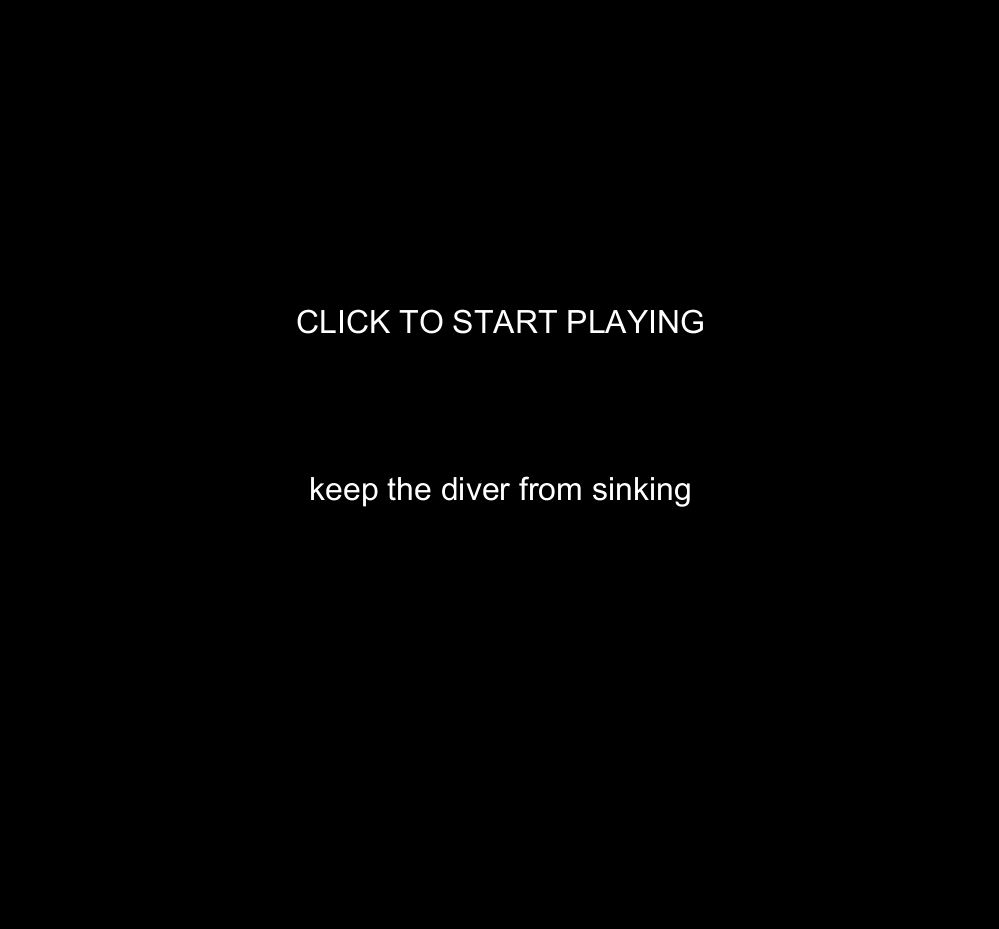
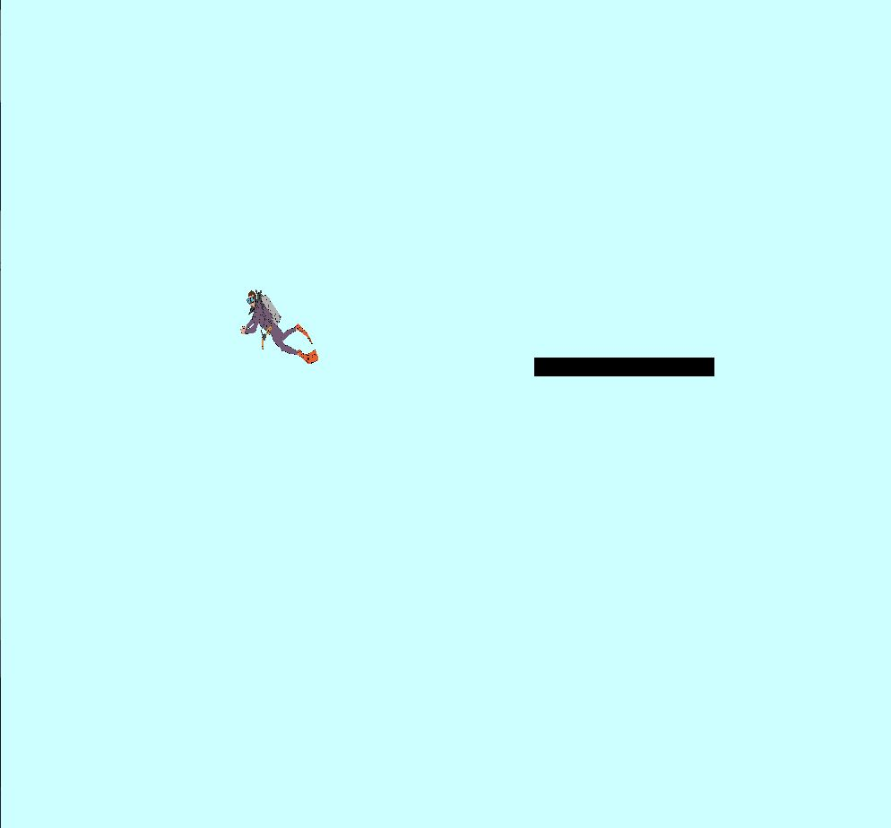
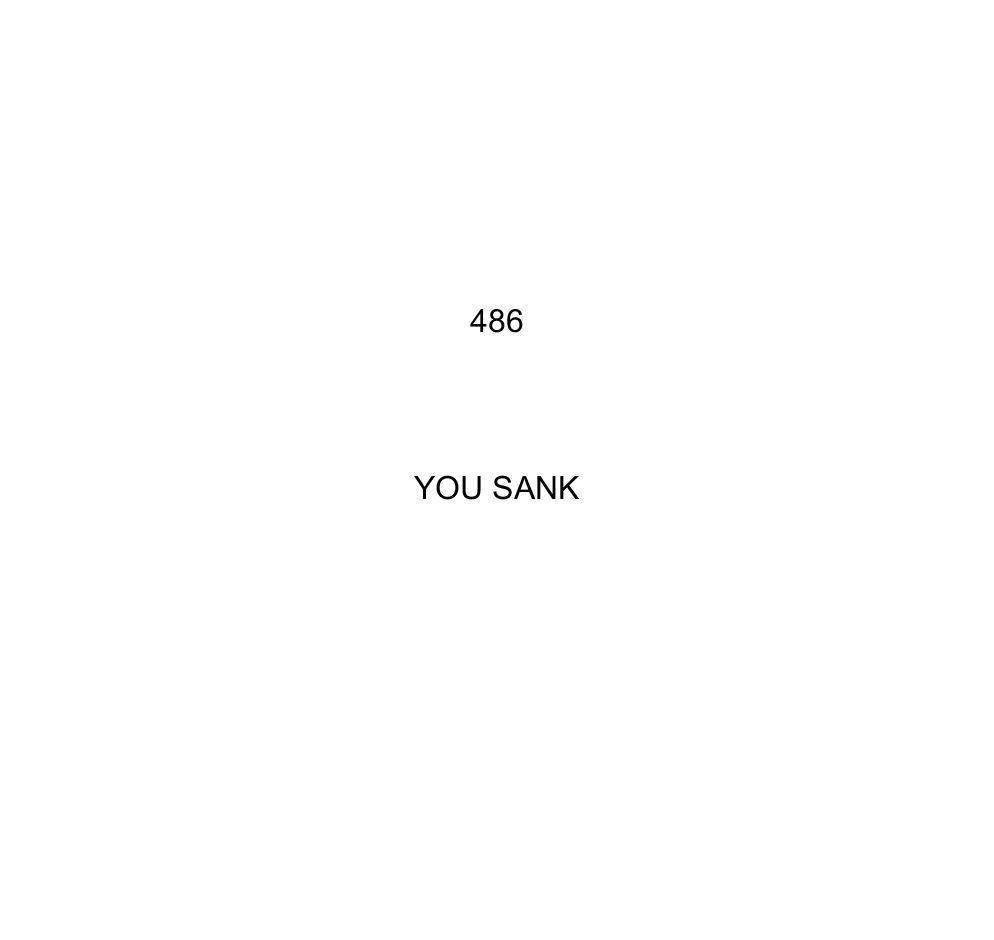

##### Process and Challenges

So far, Processing has been extrmely challenging and I consistently felt behind in the class because everyone seemed to make things that were much more elaborate than mine, but it took me a lot of time and effort to understand the basic concepts. I wasn't sure if I would be able to carry out the idea that I had in mind. I was woking off the simple concept of a bouncing ball that we did in class and expanding on it. And quite honestly, I felt scared of the midterm. I started off by watching Daniel's videos on concept vaguely similar to what I wanted to do, and then building up slowly from there and piece things together. I made the platform and the diver, but I had no idea whatsoever on how to make a timer. I googled and reserched and tried to understand things and after countless hours I finally made it work. There are a few lines of code there for the timer that I do not still completely understand (after a lot of trial and error they just worked), but other than that I knew what I was doing. And that was the biggest challenge - actually UNDERSTANDING what going on. This was honestly a gigantic step for me and I didnt think I could do it... but two all nighters later I am proud to say that it works. 

The one thing that I didnt accomplish from what I originally intended is that I wanted to be able to restart the game after you lost without having to quit the game and run the code again, but because I ran out of time I didnt manage to find a way to restart the timer. But I am still incredibly proud of what I did. 

##### Inspirations and Tutorials

These are some of the resorces that I used. These are the major ones that helped me, but Ive also referred to a lot of refferences and tutorials on processing.org (too many to list) and there might be something else that I missed because I closed the tab without taking down the link first.

https://www.youtube.com/watch?v=IIrC5Qcb2G4
https://www.youtube.com/watch?v=c8sc_w-g3-A
https://stackoverflow.com/questions/12417937/create-a-simple-countdown-in-processing
https://www.youtube.com/watch?v=UvSjtiW-RH8
https://www.youtube.com/watch?v=7BoJBYh16CQ
https://forum.processing.org/two/discussion/11161/pong-game
https://www.toptal.com/game/ultimate-guide-to-processing-simple-game

### June 16

I wanted to understand the concepts behind what we did in class, so I decided to use the example that we did with using a button to turn on the LED and built on it by adding a potentiometer to control that brighness of that LED. 

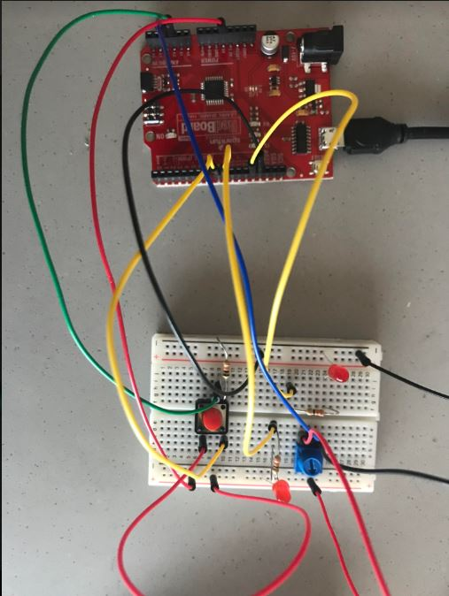
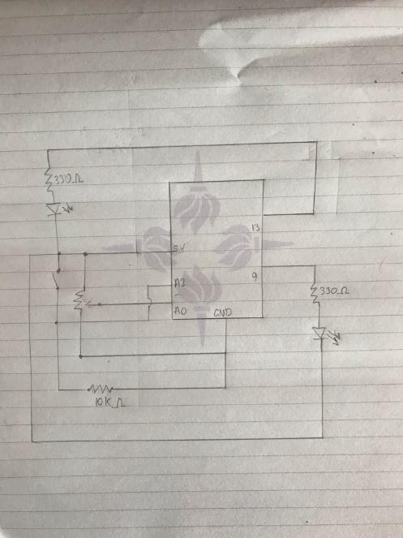

##### Challenges

I didnt actually get to run or test my code becuase I kept getting a port error that wasnt solved by restarting my computer that only got solved in class with help from Jack. Even though I have previously dran schematics in one of my classes, I was a little unsure about this one.

### June 17

I decided to make a birthday party machine. I used to buzzer to play "happy birthday" on the press of a button and then added a potentiometer to move a servo with a bow on it (for the aesthetics haha). The code for this is rather simple, but for me, the main idea behind using an example potentiometer code was that I wanted to get it to work at the same time with the song playing, and a simple code would help me focus on learning blink without delay.

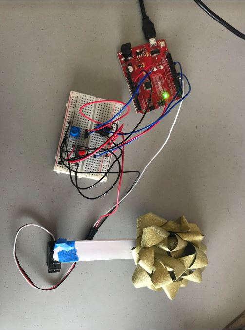

##### Challenges

I went through the tutorials, but couldnt make it work in my own code. I was running out of time and for the purposes of submitting a working assignment I went back to the simple code that does either one or the other. 

##### Resources

I used this tutorial for the "Happy Birthday" music notes https://create.arduino.cc/projecthub/jsheng/happy-birthday-lights-and-sounds-1745cd

### June 21

I am posting this now (after class) because I was hoping that i could sort out the port issue by now and I could write about how satisfying it was to get my project to work, but unfortunately that didnt happen. 

I wanted to build on my diver game that I made for the midterm to use with an arduino controlled mechanics. My goal was to understand how the communication works so I went with something simple. I wanted to use a photoresistor to control the up and down motion of the diver, whther he does up and down would be dependent on the values coming from the photoresistor and your goal is to not let the diver drop. His horizontal position is fixed though, and he would only be moving up and down in this version of the game. The rest stays the same though - if he sinks down you lose and the longer you manage to keep him afloat the more points you get. 

##### Challenges

My port keot working on and off and I couldnt find the reason for why it couldnt work so i didnt get the chance to test my project. I wrote the code based on what I thought it should be doing but it lacks the component of "oh this is not doing what I want it to do so I should try something else". So I'm not actually sure if my project works and I feel very unconfident with the whole concept of communication becasue I'm not sure if I got it right. 

##### Photos

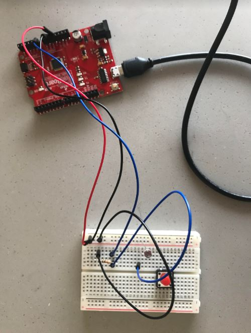
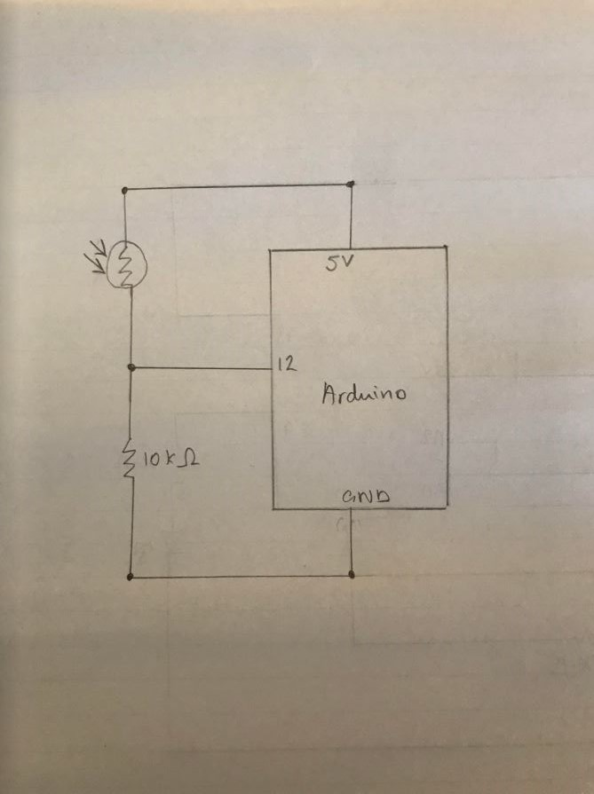

##### Resources

These are some of the additional tutorials I watched while working on my project:

https://www.youtube.com/watch?v=g0pSfyXOXj8
https://www.youtube.com/watch?v=rOUBr6Nmzec
https://arduinobasics.blogspot.com/2012/06/jumper-arduino-controlled-animation.html
