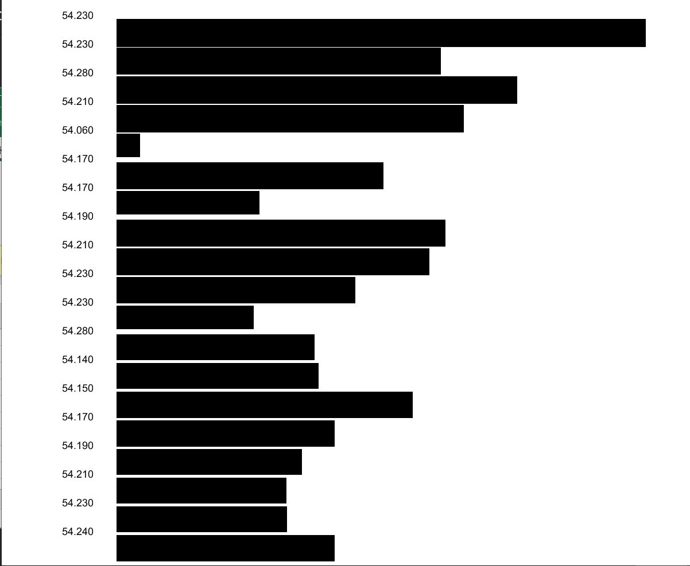

# Intro to IM Assignments

### June 2

I wanted to make a backround of moving circles and a bouncing circle on top, but after experimenting with that I found it too difficult to look and and decided to make them static. 

I used a nested for loop to make the background and experimented with the example from the class to make the circle on top.

### June 3

I got the idea for my artwork from one of Daniel's video about functions where he used a star. I wanted to make an artwork where there is a setting sun and as it sets, multiple stars pop on on the screen. 
##### Challenges 
I faced a lot of challenges. I havent actually used processing before, and I find coding in general quite challenging. I watched Daniel's videos on functions and OOP and then watched them again trying to understand exactly what he is doing and how it works and what each line is doing. I then went back to the examples we did in class and tried to do it on my own without looking to see if I understood it. I then tried to write my own twist on it and use the code to write something that I want it to do, but that took me a very long time. I then tried to debug it and understand what I did wrong. 

### June 7
I wanted to display the data in an abstact bar shart, abstract because the bars don't represent direct values but rather scaled down to look best aesthetically. I was aiming for something minimalistic so I opted for black bars on a white background. 
It was challenging to me because I was still trying to wrap my head around how processing works, but I'm quite happy with how it looks.

The data is taken from https://www.ndbc.noaa.gov
